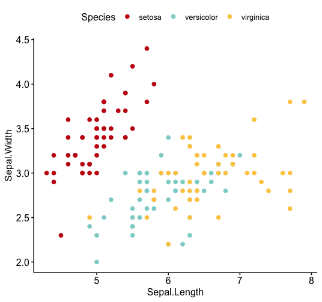

# MadisonPalette
R palette for plotting compatible with UW Madison themed presentations.

Colors taken from theming in PowerPoint templates, available here: 
https://brand.wisc.edu/multimedia/powerpoint/

# Example
```
library("ggpubr")
library("MadisonPalette")
ggscatter(iris, x="Sepal.Length", y="Sepal.Width", color="Species", palette=madison_categorical)
```

# Disclaimer
This is meant as a quick tool to help UW Madison affliates prepare plots that integrate nicely with PowerPoint templates. Provided as-is with no support.
